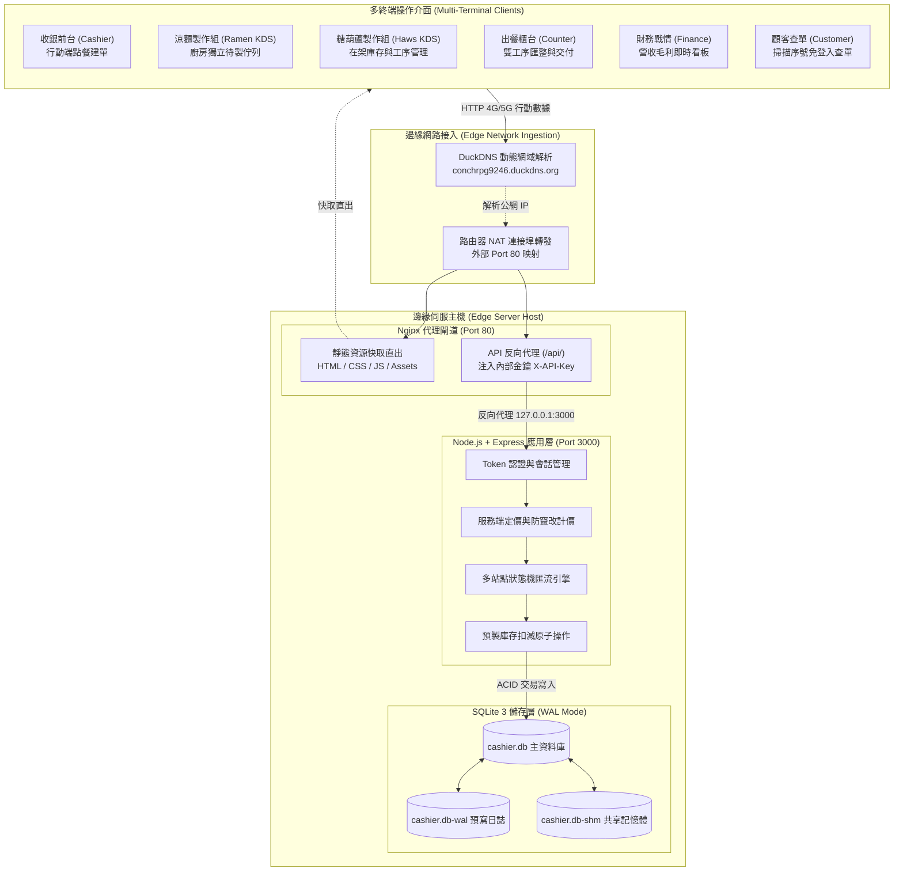
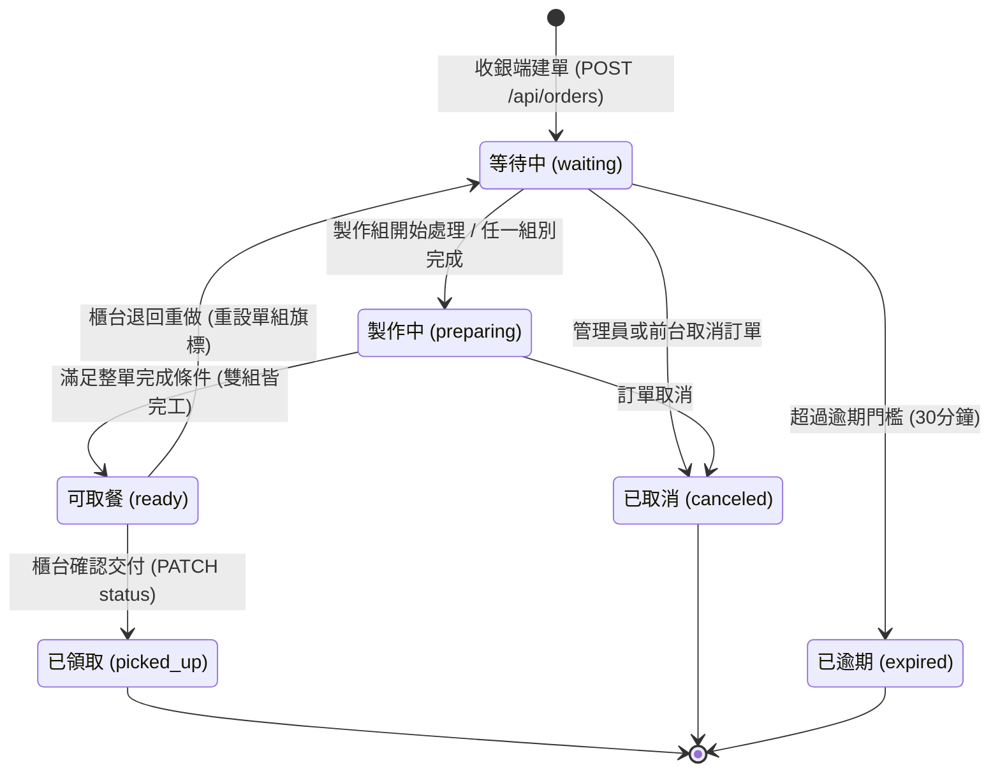
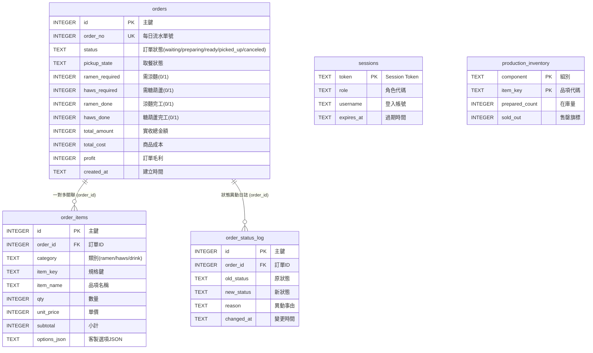

# 武告喝甲 - 園遊會高併發收銀與多站點流程管理系統 (Cashier System)

> **專為校園實體高尖峰活動設計之邊緣部署 (Edge Deployment)、狀態機驅動 POS & 廚房出餐 (KDS) 協同管理系統**

[](https://nodejs.org/)
[](https://expressjs.com/)
[-003B57?style=flat-square&logo=sqlite)](https://www.sqlite.org/wal.html)
[](https://nginx.org/)
[](https://developer.mozilla.org/zh-TW/docs/Web/JavaScript)
[](Server/test/smoke.test.js)
[-brightgreen?style=flat-square)](https://github.com/ytconch/Cashier-System)
[](LICENSE)

---

## 📑 目錄 (Table of Contents)

1. [系統架構 (Architecture)](#1-系統架構-architecture)
   - 1.1 [邊緣拓撲與軟體分層 (Edge Topology and Software Layering)](#11-邊緣拓撲與軟體分層-edge-topology-and-software-layering)
   - 1.2 [多站點工作流與有限狀態機 (Workflow Pipeline and Finite State Machine)](#12-多站點工作流與有限狀態機-workflow-pipeline-and-finite-state-machine)
   - 1.3 [核心工程機制與技術權衡 (Key Engineering Mechanisms and Trade-Offs)](#13-核心工程機制與技術權衡-key-engineering-mechanisms-and-trade-offs)
   - 1.4 [資料庫綱要與實體關聯模型 (Database Schema and ERD)](#14-資料庫綱要與實體關聯模型-database-schema-and-erd)
2. [快速啟動 (Getting Started)](#2-快速啟動-getting-started)
   - 2.1 [環境先決條件 (Prerequisites)](#21-環境先決條件-prerequisites)
   - 2.2 [本機啟動步驟 (Quick Start Commands)](#22-本機啟動步驟-quick-start-commands)
   - 2.3 [預設測試帳號矩陣 (Default Test Accounts)](#23-預設測試帳號矩陣-default-test-accounts)
   - 2.4 [主要服務端點與展示 (Service Endpoints and Showcase)](#24-主要服務端點與展示-service-endpoints-and-showcase)
3. [參考文獻 (References)](#3-參考文獻-references)

---

## 1. 系統架構 (Architecture)

### 1.1 邊緣拓撲與軟體分層 (Edge Topology and Software Layering)

針對校園線下活動短時瞬態高流量 (Burst Traffic)、無外部雲端維運預算之情境，系統採用**分層邊緣運算拓撲 (Tiered Edge Topology)**。全系統運行於地端邊緣主機，結合動態網域解析、Nginx 反向代理、Node.js 核心應用與 WAL 模式嵌入式資料庫：



- **零雲端租用成本 (Zero Cloud Cost)**：以實體地端主機配合 DuckDNS 動態解析與家用路由器連接埠轉發，免除雲端主機租賃開銷。
- **邊緣反向代理安全注入**：Nginx 對外監聽 Port 80 並直出靜態資源；在轉發 `/api/` 請求至後端時，由 Nginx 自動注入內部 `X-API-Key` 金鑰，金鑰不落地前端客戶端，有效防止未經授權之 API 直連。

---

### 1.2 多站點工作流與有限狀態機 (Workflow Pipeline and Finite State Machine)

系統針對園遊會現場異質工序（即食品糖葫蘆、現製涼麵、免廚房常規飲料）實作**有限狀態機 (Finite State Machine, FSM)**，負責非同步拆單、製作進度追蹤與出餐齊備性匯流：



#### 核心布林聚合邏輯 (Core State Determination)
```javascript
// Server/server.js 狀態機自動躍遷核心邏輯
const ramenDone = (order.ramen_required === 0 || order.ramen_done === 1);
const hawsDone  = (order.haws_required === 0 || order.haws_done === 1);

if (ramenDone && hawsDone) {
  nextStatus = 'ready';       // 雙工序皆完工（或純飲料無廚房需求），訂單自動躍遷為可取餐
} else if (order.ramen_done === 1 || order.haws_done === 1) {
  nextStatus = 'preparing';   // 任一組完成但未齊備，維持製作中狀態
} else {
  nextStatus = 'waiting';     // 兩組均在佇列中等待
}
```

- **混合訂單非同步匯流**：收銀建單後依品項自動拆解至涼麵與糖葫蘆工作站。出餐櫃台必須等待雙組皆回報完工，整單狀態方可躍遷為 `ready`（可取餐叫號）。
- **純飲料直出捷徑**：若單筆訂單僅包含包裝飲料（`ramen_required = 0, haws_required = 0`），建單時系統判定無廚房前置工序，直接以 `ready` 狀態落檔供前台交付。
- **逆向退回重做 (Rework) 獨立旗標機制**：若櫃台核單發現餐點客製不符（例如誤放小黃瓜），執行退回重做時**僅重設特定組別旗標**（如 `ramen_done = 0`），糖葫蘆之完工旗標 (`haws_done = 1`) 完整保留，整單退回 `waiting`，重製完成後自動恢復為 `ready`。

---

### 1.3 核心工程機制與技術權衡 (Key Engineering Mechanisms and Trade-Offs)

| 維度 | 本專案選型 | 傳統/重型替代方案 | 關鍵選型理由與工程權衡 (Trade-Offs) |
| :--- | :--- | :--- | :--- |
| **前端架構** | **原生 Vanilla ES6+ HTML5/CSS** | React / Vue / Vite SPA | **零打包開銷、秒級載入**。工作人員以個人手機瀏覽器掃碼即可進入各站點，單頁資源 < 15KB，免除前端構建版本相衝與載入白屏。 |
| **後端框架** | **Node.js + Express.js** | Python Flask / Java Spring | **非同步 I/O 效率高、低記憶體佔用**。單執行緒事件循環極其適合處理高頻短週期 HTTP 輪詢與 JSON API，記憶體佔用低於 50MB。 |
| **資料庫引擎** | **SQLite 3 (better-sqlite3)** | MySQL / PostgreSQL | **零維運成本、單檔資料庫、讀寫分離**。啟用 WAL 模式達成讀不阻塞寫、寫不阻塞讀，免除連線池與獨立服務管理開銷。 |
| **通訊協定** | **短週期 HTTP 輪詢 (2–3s)** | WebSocket / Socket.io | **高強健性、網路斷線自癒**。園遊會人潮密集區行動網路易瞬斷，HTTP 輪詢具備天然冪等性與自動重試能力，免除複雜心跳管理。 |
| **安全機制** | **Nginx 注入金鑰 + SQLite Token** | JWT (無狀態) / OAuth2 | **集中撤銷會話、敏感金鑰不落地客戶端**。Nginx 代理層阻擋外部直接存取後端 Port，SQLite Session 表支援異常工作階段即刻註銷。 |

#### 服務端防竄改計價機制 (Server-Side Price Validation)
前端僅發送品項代碼與客製選項，**完全不信任客戶端傳遞之價格數值**。後端統一由 [Server/config.js](Server/config.js) 官方定價字典重算基價、加料費用與自備餐具折讓（-5 元），從根本杜絕客戶端竄改金額風險。

---

### 1.4 資料庫綱要與實體關聯模型 (Database Schema and ERD)

系統資料庫建構於 [Server/schema.sql](Server/schema.sql)，包含 6 張核心資料表：



- **事務原子性 (ACID Guarantee)**：建單作業透過 `db.transaction()` 將主表建立、明細寫入、在架預製品庫存扣減與初始狀態日誌紀錄完整包裹，失敗時自動回滾 (Rollback)。
- **WAL 模式讀寫分離**：啟用 `PRAGMA journal_mode = WAL;`，將所有交易寫入 `.db-wal` 預寫日誌檔，高頻併發下讀取不鎖定寫入、寫入不阻塞讀取，實現現場 201 筆交易零死鎖、零損毀記錄。

---

## 2. 快速啟動 (Getting Started)

### 2.1 環境先決條件 (Prerequisites)

- **Node.js**：`v18.0.0` 或更高版本 (本系統於 `v24.18.0` 通過完整實測)
- **NPM**：`v9.0.0` 或更高版本

---

### 2.2 本機啟動步驟 (Quick Start Commands)

```bash
# 1. 複製專案庫
git clone https://github.com/ytconch/Cashier-System.git
cd Cashier-System/Server

# 2. 安裝相依套件 (better-sqlite3 與 express)
npm install

# 3. 執行自動化回歸測試 (驗證 7 項核心合約與狀態機正確性)
npm test
# 註：Windows PowerShell 環境若受限於腳本執行原則 (PSSecurityException)，可改以 npm.cmd test 或 node test/smoke.test.js 執行

# 4. 啟動伺服器 (預設監聽 Port 3000)
npm start
```

---

### 2.3 預設測試帳號矩陣 (Default Test Accounts)

| 角色組別 | 帳號 (Username) | 密碼 (Password) | 專屬操作端點與職責權限 |
| :--- | :--- | :--- | :--- |
| **收銀組** | `cashier` | `cashier123` | `cashier.html` - 快速建單、客製配料選填、自備餐具折讓 |
| **涼麵製作組** | `ramen` | `ramen123` | `kitchen-ramen.html` - 涼麵獨立待製佇列、標記完工、即時售罄回報 |
| **糖葫蘆製作組**| `haws` | `haws123` | `kitchen-haws.html` - 糖葫蘆獨立佇列、預製品在庫數量維護 |
| **出餐櫃台** | `counter` | `counter123` | `counter.html` - 雙組進度匯整、叫號取餐交付、退回重新製作 |
| **財務戰情** | `finance` | `finance123` | `finance.html` - 即時營收、毛利核算、時段單量分佈監控 (2s 輪詢) |
| **系統管理員** | `admin` | `admin123` | `app.html` - 全局權限監控、強制狀態重置、取消單處理 |
| **顧客端** | *免登入* | *免密碼* | `customer.html` - 顧客掃描收據二維碼免登入即時查詢餐點進度 |

---

### 2.4 主要服務端點與展示 (Service Endpoints and Showcase)

伺服器啟動完成後，開啟瀏覽器即可進入對應端點：
- **系統入口登入頁**：`http://localhost:3000/` 或 `http://localhost:3000/index.html`
- **顧客端查單頁**：`http://localhost:3000/customer.html`
- **財務即時戰情看板**：`http://localhost:3000/finance.html`

#### 核心操作工作站介面展示
| 收銀前台 (`cashier.html`) | 後勤廚房 (`kitchen-ramen.html`) | 出餐櫃台 (`counter.html`) |
| :---: | :---: | :---: |
|  |  |  |

#### 生產環境 Nginx 反向代理配置範例
在正式部署環境中，Nginx 監聽 Port 80 並自動注入內部金鑰至後端：

```nginx
server {
  listen 80;
  server_name conchrpg9246.duckdns.org;

  # 靜態前端資源由 Nginx 高效快取直出
  location / {
    root /path/to/Cashier-System/Server/public;
    index index.html;
    try_files $uri $uri/ /index.html;
  }

  # 後端 API 反向代理，自動注入內部安全金鑰
  location /api/ {
    proxy_pass http://127.0.0.1:3000;
    proxy_http_version 1.1;
    proxy_set_header Host $host;
    proxy_set_header X-Real-IP $remote_addr;
    proxy_set_header X-Forwarded-For $proxy_add_x_forwarded_for;
    proxy_set_header X-Forwarded-Proto $scheme;
    
    # 注入與 config.js systemKey 匹配之安全金鑰
    proxy_set_header X-API-Key CHANGE_THIS_TO_A_LONG_RANDOM_KEY;
  }
}
```

---

## 3. 參考文獻 (References)

1. **RESTful 架構風格與分散式超媒體系統**  
   Fielding, R. T. (2000). *Architectural Styles and the Design of Network-based Software Architectures*. Doctoral dissertation, University of California, Irvine.  
   URL: [https://www.ics.uci.edu/~fielding/pubs/dissertation/top.htm](https://www.ics.uci.edu/~fielding/pubs/dissertation/top.htm)
2. **反應式系統與有限狀態機階層模型 (Statecharts / FSM)**  
   Harel, D. (1987). *Statecharts: A Visual Formalism for Complex Systems*. Science of Computer Programming, 8(3), 231-274.  
   DOI: [10.1016/0167-6423(87)90035-9](https://doi.org/10.1016/0167-6423(87)90035-9)
3. **資料庫交易處理概念與技術 (ACID & WAL 原理)**  
   Gray, J., & Reuter, A. (1992). *Transaction Processing: Concepts and Techniques*. Morgan Kaufmann Publishers.
4. **SQLite 預寫日誌 (Write-Ahead Logging, WAL) 架構設計**  
   Hipp, D. R., et al. (2010). *Write-Ahead Logging*. SQLite Official Documentation.  
   URL: [https://www.sqlite.org/wal.html](https://www.sqlite.org/wal.html) | [https://sqlite.org/whentouse.html](https://sqlite.org/whentouse.html)
5. **Nginx 高效反向代理與安全標頭轉發架構**  
   Sysoev, I., et al. *Module ngx_http_proxy_module Reference & Security Guidelines*. F5 / Nginx Documentation.  
   URL: [https://nginx.org/en/docs/http/ngx_http_proxy_module.html](https://nginx.org/en/docs/http/ngx_http_proxy_module.html)
6. **Express.js 應用程式架構與中介軟體管線 (Middleware Pipeline)**  
   OpenJS Foundation. *Express.js Routing and Error Handling Guidelines*.  
   URL: [https://expressjs.com/en/starter/hello-world.html](https://expressjs.com/en/starter/hello-world.html)
