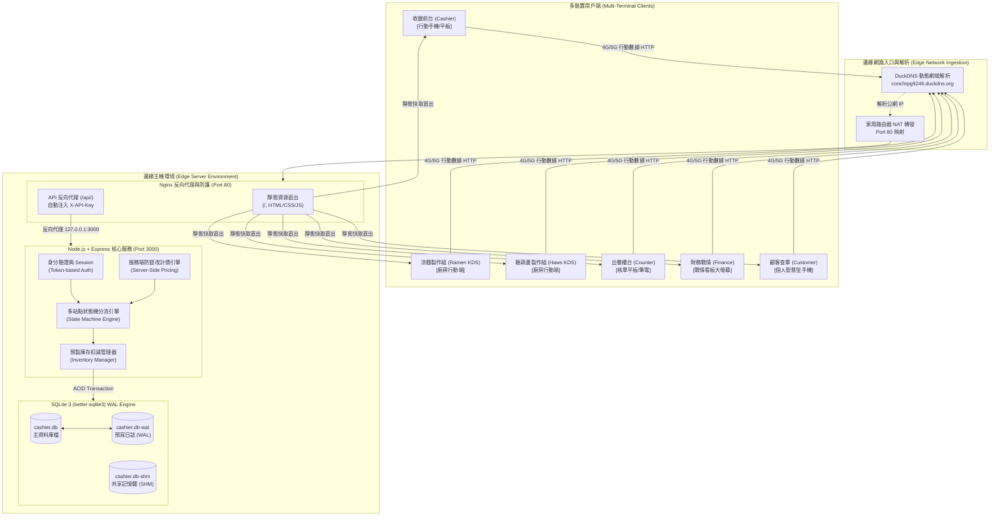
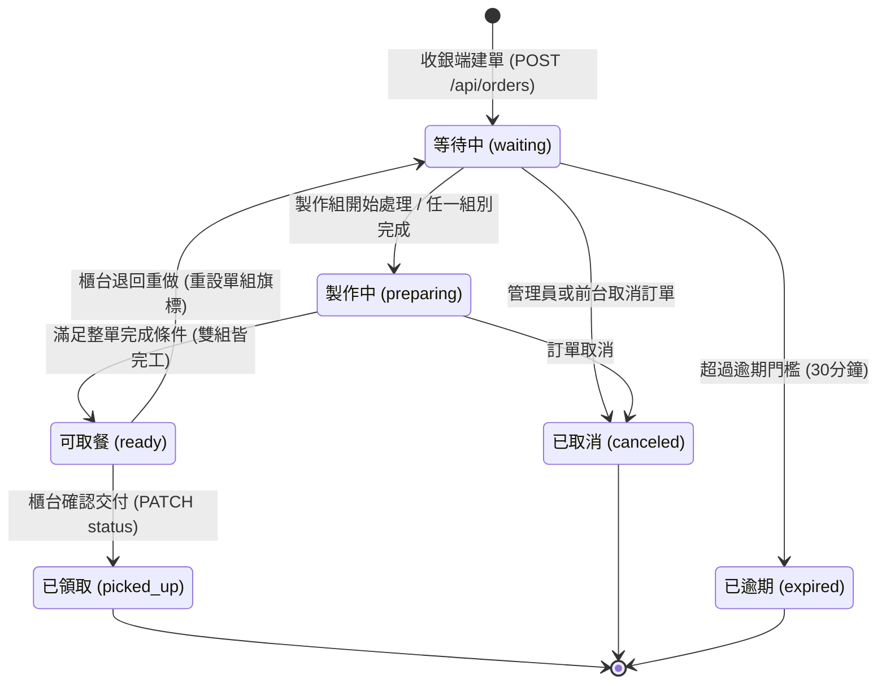
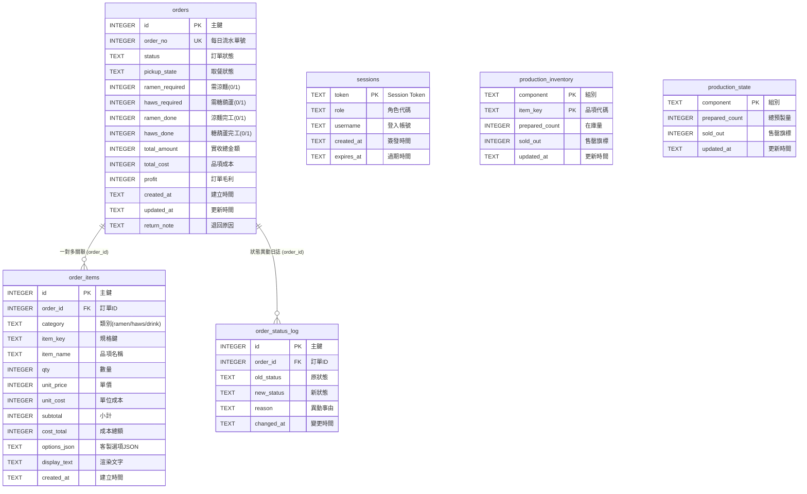
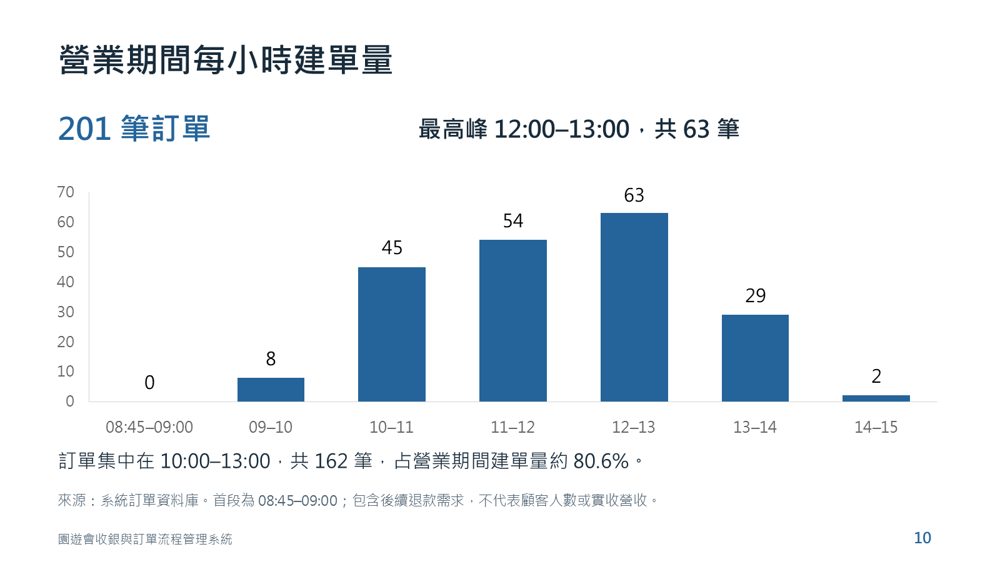
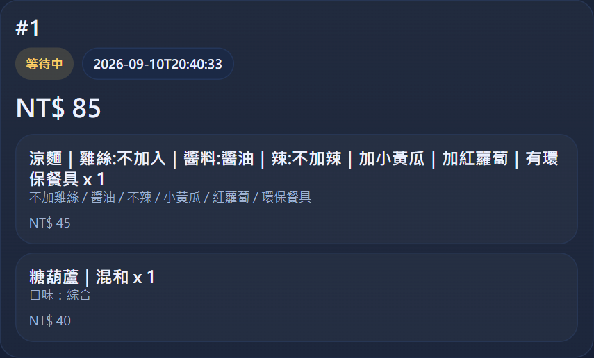
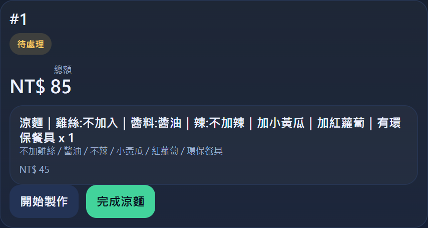
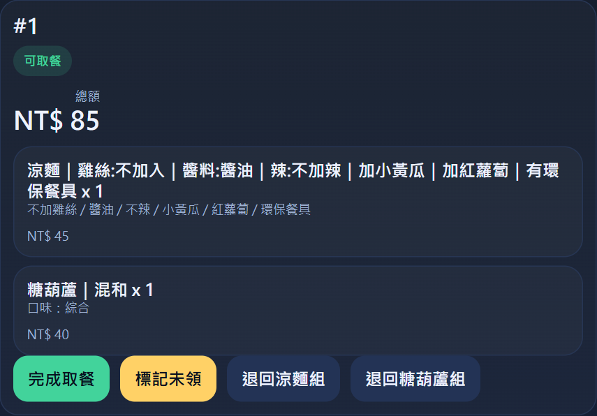
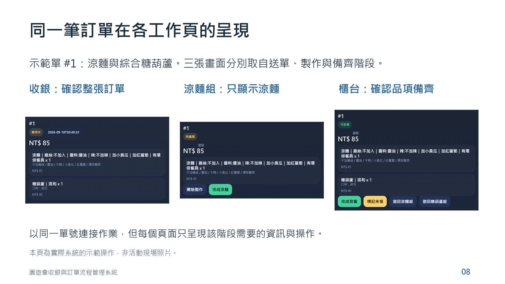
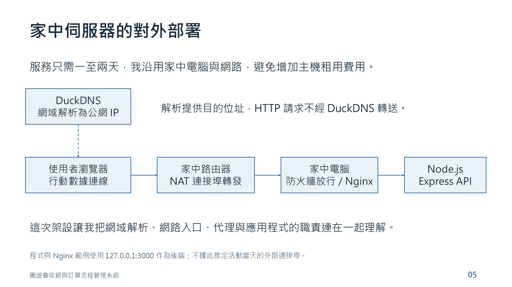
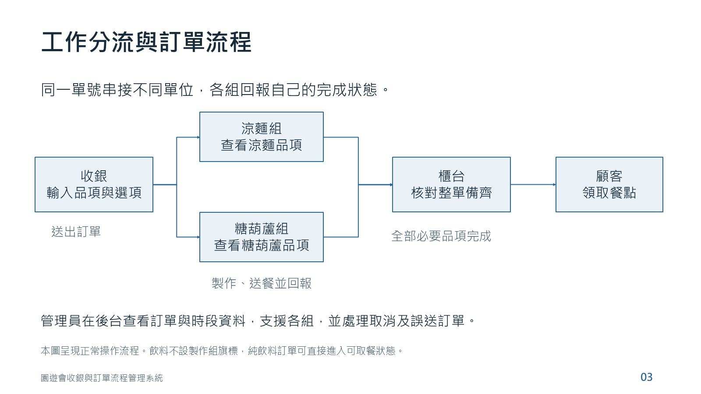

# 武告喝甲 - 園遊會高併發收銀與多站點流程管理系統 (Cashier System)

> **專為校園高尖峰實體活動設計之邊緣部署 (Edge Deployment)、低延遲、狀態機驅動的 POS & 廚房出餐 (KDS) 協同管理系統**

[](https://nodejs.org/)
[](https://expressjs.com/)
[-003B57?style=flat-square&logo=sqlite)](https://www.sqlite.org/wal.html)
[](https://nginx.org/)
[](https://developer.mozilla.org/zh-TW/docs/Web/JavaScript)
[](Server/test/smoke.test.js)
[-brightgreen?style=flat-square)](https://github.com/ytconch/Cashier-System)
[](LICENSE)

> 📄 **專題成果報告 PDF 下載**：[《清水高中園遊會收銀與訂單流程管理系統專案成果報告 (完成版)》](docs/project-report.pdf)（亦可參閱 [中文檔名存檔](docs/詹秉睿_園遊會收銀系統專案報告_完成版.pdf)）

---

## 📑 目錄 (Table of Contents)

1. [專案背景與研究動機 (Project Motivation)](#1-專案背景與研究動機-project-motivation)
2. [系統總體架構與網路拓撲 (System Architecture & Network Topology)](#2-系統總體架構與網路拓撲-system-architecture-network-topology)
3. [多站點工作流與有限狀態機 (Workflow Pipeline & Finite State Machine)](#3-多站點工作流與有限狀態機-workflow-pipeline-finite-state-machine)
4. [核心工程設計與技術選型權衡 (Key Engineering Decisions & Trade-Offs)](#4-核心工程設計與技術選型權衡-key-engineering-decisions-trade-offs)
5. [資料庫綱要與關聯模型 (Database Schema & ERD)](#5-資料庫綱要與關聯模型-database-schema-erd)
6. [現場營運實證與數據分析 (Empirical Field Operation & Analytics)](#6-現場營運實證與數據分析-empirical-field-operation-analytics)
7. [營運後工程反思與虛實落差 (Cyber-Physical Post-Mortem & Reflection)](#7-營運後工程反思與虛實落差-cyber-physical-post-mortem-reflection)
8. [學術誠信與 AI 協作角色界定 (Academic Integrity & AI Attribution)](#8-學術誠信與-ai-協作角色界定-academic-integrity-ai-attribution)
9. [品質保證與自動化測試體系 (Verification & Quality Assurance)](#9-品質保證與自動化測試體系-verification-quality-assurance)
10. [系統介面展示 (System UI Showcase)](#10-系統介面展示-system-ui-showcase)
11. [快速上手與環境重現 (Quick Start & Reproducibility)](#11-快速上手與環境重現-quick-start-reproducibility)
12. [RESTful API 規格文件 (API Specification)](#12-restful-api-規格文件-api-specification)
13. [參考文獻與技術規範 (References)](#13-參考文獻與技術規範-references)

---

## 1. 專案背景與研究動機 (Project Motivation)

### 1.1 實務痛點分析 (Problem Statement)
校園園遊會、文創市集與快閃餐飲等線下高密度商業場景中，具有以下嚴苛的運作限制：
- **瞬態高尖峰流量 (Burst Traffic)**：交易高度集中於特定用餐時段（如 10:00–13:00），短時間內湧入大量客流，任何系統延遲或卡頓均會導致現場動線堵塞。
- **異質工序並行分流 (Heterogeneous Production Pipeline)**：一份訂單往往同時涵蓋即食品（如預製糖葫蘆）、現製品（如現拌涼麵、客製蔬菜配料與辣度）與常規飲料，各由不同後勤小組處理。
- **傳統紙本模式之系統性失效**：
  - 手寫單號易被湯汁污損、漏單或字跡辨識混淆。
  - 後勤製作組無法即時獲知即時待製數量，導致供過於求或現場缺料。
  - 出餐櫃台需以人工口頭反覆確認各組出餐進度，產生顯著的溝通摩擦與等待延遲。
  - 帳目統計與營收結算於活動結束後需耗費數小時人工點算，且難以回溯異常退單。

### 1.2 專案目標與工程價值 (Project Objectives)
本專案由作者獨立主導架構與全端實現，旨在建立一套具備**低維運成本、高強健性、多站點非同步協同作業**的邊緣型收銀與訂單管理系統 (POS + KDS)：
1. **零雲端租用成本的邊緣部署 (Zero-Cost Edge Deployment)**：以家用伺服器、DuckDNS 動態域名解析與 NAT 連接埠轉發建置低成本對外服務。
2. **多端響應式零建置架構 (Zero-Build Multi-Station Client)**：採用原生前端技術，工作人員無需安裝 App，透過一般智慧型手機、平板或筆電之瀏覽器掃碼即可依身分進入專屬工作站。
3. **混合訂單非同步匯流狀態機 (Asynchronous Multi-Station State Machine)**：自動拆解訂單品項至對應後勤組別，實作雙組獨立回報與自動聚合判定機制。
4. **高併發讀寫分離與資料一致性 (WAL Concurrency & ACID Guarantee)**：採用 SQLite 3 WAL (Write-Ahead Logging) 模式與原子性資料庫事務，確保高壓併發寫入時零死鎖、零漏單。

> [!NOTE]
> **真實營運驗證**：本系統於 **2026 年 4 月 18 日清水高中校慶園遊會（班級攤位：武告喝甲）** 全天現場實測上線（08:45–15:00），在 6 小時 15 分鐘內成功處理 **201 筆真實交易**，尖峰時段達 **63 筆/小時**，系統達成 **100% 可用度 (Zero Downtime)** 與 **零資料遺失 (Zero Data Corruption)**。

---

## 2. 系統總體架構與網路拓撲 (System Architecture & Network Topology)

本系統採用分層邊緣運算拓撲 (Tiered Edge Topology)，由行動用戶端、動態網域解析、邊緣反向代理、Node.js 應用層與 WAL 嵌入式儲存引擎組成：



### 2.1 架構核心亮點
1. **家用邊緣部署 (Zero Cloud Cost Edge Hosting)**：
   服務僅需於活動期間運作，透過家中主機與家用網路配合 DuckDNS 動態解析，徹底免除外部雲端伺服器 (AWS/GCP/Heroku) 之月租與維運開銷。
2. **Nginx 反向代理憑據注入 (Reverse-Proxy Header Injection)**：
   系統核心 API 要求 `X-API-Key` 內部金鑰。前端 JavaScript 不硬編碼或傳遞敏感密鑰，而是由 Nginx 在轉發 `/api/` 請求時於本地回環 (Loopback `127.0.0.1:3000`) 動態追加 `proxy_set_header X-API-Key <SECRET>`，有效杜絕客戶端審查網路封包竊取金鑰之風險。
3. **無建置開銷的前端交付 (No-Build Asset Serving)**：
   靜態前端檔案無 Webpack/Vite 複雜打包產物，直接由 Nginx 快速分發，提升行動載具載入速度並簡化現場熱修正 (Hotfix) 流程。

---

## 3. 多站點工作流與有限狀態機 (Workflow Pipeline & Finite State Machine)

### 3.1 站點分工與角色權限矩陣 (Station Responsibility Matrix)

| 站點角色 | 預設帳號 | 專屬操作頁面 | 核心職責與資料流向 |
| :--- | :--- | :--- | :--- |
| **收銀組 (Cashier)** | `cashier` | `cashier.html` | 快速建單、輸入客製選項（加辣、自備餐具折扣、蔬菜配料）、觸發後端計價與庫存扣減。 |
| **涼麵製作組 (Ramen)** | `ramen` | `kitchen-ramen.html` | 即時監聽涼麵佇列、確認客製化標籤（紅蘿蔔/小黃瓜/辣度/環保餐具）、回報售罄與製作完畢。 |
| **糖葫蘆製作組 (Haws)** | `haws` | `kitchen-haws.html` | 監控現製糖葫蘆佇列、預製品口味（綜合/全葡萄/全番茄）即時在庫量盤點與快速補貨。 |
| **出餐櫃台 (Counter)** | `counter` | `counter.html` | 雙組製作狀態匯整、核對餐點齊備性、叫號取餐交付；執行「退回重做 (Rework)」例外處理。 |
| **財務戰情 (Finance)** | `finance` | `finance.html` | 即時營收、毛利、時段單量趨勢 (Hourly Orders)、商品銷量排行監控與即時自動輪詢 (2s)。 |
| **顧客查單 (Customer)** | *免登入* | `customer.html` | 顧客掃描收據二維碼或輸入單號，免登入查詢餐點進度（等待中 / 製作中 / 可取餐 / 已領取）。 |
| **管理員 (Admin)** | `admin` | `app.html` | 全局權限監控、手動跨組調度、取消單處理與系統設定維護。 |

---

### 3.2 混合訂單 (Hybrid Order) 狀態轉移邏輯

當單筆訂單同時包含「涼麵」與「糖葫蘆」時，出餐櫃台必須等待**兩組皆回報製作完畢**，整單狀態方可由「製作中 (`preparing`)」晉級為「可取餐 (`ready`)」：



#### 核心布林判定邏輯 (Core State Determination)
```javascript
// 後端核心狀態彙整判定式 (Server/server.js)
const ramenDone = (order.ramen_required === 0 || order.ramen_done === 1);
const hawsDone  = (order.haws_required === 0 || order.haws_done === 1);

// 當且僅當所有必需工序均完工，訂單狀態自動躍遷為 ready
if (ramenDone && hawsDone) {
  nextStatus = 'ready';
} else if (order.ramen_done === 1 || order.haws_done === 1) {
  nextStatus = 'preparing';
} else {
  nextStatus = 'waiting';
}
```
*特殊規則：純飲料訂單（如冰紅茶、綠茶）無需經過廚房製作旗標 (`ramen_required=0, haws_required=0`)，建單後直接進入 `ready`（可取餐）狀態，大幅節省飲料出餐延遲。*

---

### 3.3 逆向退回重新製作機制 (Return / Rework Pipeline)
若出餐櫃台發現實體餐點與訂單客製化選項不符（例如：顧客要求「不加小黃瓜」但出餐組誤加），櫃台操作員可點擊「退回重做」並輸入原因：
1. 系統**僅重設指定組別**之完成旗標（如 `ramen_done = 0`），而**糖葫蘆之完成標記 (`haws_done = 1`) 予以完整保留**。
2. 整單狀態退回 `waiting`，並重新出現在該組廚房螢幕頂部，附加醒目退回原因。
3. 後勤組重新補製送出後，系統自動重新執行匯整判定，無縫重回 `ready`。

---

## 4. 核心工程設計與技術選型權衡 (Key Engineering Decisions & Trade-Offs)

在系統設計之初，作者向 AI 工具諮詢評估並結合實體場域約束，做出以下關鍵工程抉擇：

### 4.1 技術選型對比論證表 (Architecture Decision Matrix)

| 維度 | 本專案選型 | 傳統/重型替代方案 | 關鍵選型理由與工程權衡 (Engineering Trade-offs) |
| :--- | :--- | :--- | :--- |
| **前端架構** | **原生 Vanilla ES6+ HTML5/CSS** | React / Vue / Vite SPA | **零打包、超輕量**。現場工作人員使用個人手機瀏覽器，原生靜態檔案無白屏載入延遲，單頁尺寸 < 15KB，免除 Node.js 前端構建與相依版本相衝風險。 |
| **後端框架** | **Node.js + Express.js** | Python Flask / Java Spring | **高並發非同步 I/O 效率高**。單執行緒事件循環極其適合處理頻繁的短週期 HTTP 輪詢與 JSON API 請求，輕量且記憶體佔用極低 (< 50MB)。 |
| **資料庫引擎** | **SQLite 3 (better-sqlite3)** | MySQL / PostgreSQL | **零維運、隨選隨跑、單檔備份**。免除獨立資料庫伺服器連線池與認證開銷；透過 WAL 模式達成單寫多讀，完美滿足短週期高強度交易需求。 |
| **通訊模式** | **短週期 HTTP Polling (2–3s)** | WebSocket / Socket.io | **高強健性、自動重連免維護**。行動網路在人潮密集區訊號易瞬斷，WebSocket 需大量的心跳檢測與斷線重連狀態維護；HTTP 輪詢天生冪等且具備自我復原能力。 |
| **安全性機制** | **Nginx 注入 API Key + Token Session** | JWT (無狀態) / OAuth2 | **權限即時註銷能力**。SQLite 持久化 Session 允許管理員隨時遠端終止異常工作階段；Nginx 代理層阻擋外部直接存取核心 API。 |

### 4.2 服務端防竄改計價引擎 (Server-Side Price Validation)
在安全性方面，本系統徹底實施**「零信任客戶端」原則**：
- 前端收銀介面僅發送品項代碼與選項 Key（例如：`{ category: 'ramen', options: { chicken: 'add', eco: true } }`）。
- 後端收到請求後，**完全忽略前端提交之任何價格數值**，統一以伺服器端 [Server/config.js](Server/config.js) 中的官方定價字典重新逐項加總基底價、加料價與自備餐具折讓（-5 元），從根本杜絕前端利用 F12 或 Proxy 竄改交易金額之可能性。

---

## 5. 資料庫綱要與關聯模型 (Database Schema & ERD)

本系統資料模型由 6 張核心關聯表構成，建置於 [Server/schema.sql](Server/schema.sql) 中：



### 5.1 交易原子性與 WAL 併發優勢 (ACID Guarantee via WAL)
- **寫入交易原子性 (`db.transaction`)**：
  建單時，主表寫入、明細表寫入、糖葫蘆在架預製品庫存即時扣減、初始狀態日誌紀錄全部包裹於單一 SQLite 交易區塊。若庫存不足或中途發生例外，系統保證整體 Rollback，避免出現孤立半成單。
- **WAL 讀寫分離機制**：
  傳統 SQLite 寫入時會鎖定整份資料庫，導致前端查詢超時。本系統啟用 `PRAGMA journal_mode = WAL;`，將資料變更寫入 `.db-wal` 預寫日誌，達成**「讀不阻塞寫、寫不阻塞讀」**的高併發表現，在活動全天無任何鎖定崩潰。

---

## 6. 現場營運實證與數據分析 (Empirical Field Operation & Analytics)

本專案非停留在實驗室的玩具雛形，而是完整經歷**真實校園商業活動嚴苛考驗**的實證專案。

### 6.1 活動營運基本統計指標
- **實測日期**：2026 年 4 月 18 日 (六)
- **營運時間**：08:45 – 15:00 (共計 6 小時 15 分鐘)
- **活動地點**：清水高中校慶園遊會・201 班級攤位「武告喝甲」
- **資料庫真實存檔單量**：**201 筆訂單** (保存於 [Server/data/cashier.db](Server/data/cashier.db))
- **系統穩定度指標**：**100% 稼動率 (0 次 Crash, 0 次重啟, 0 筆遺失)**

---

### 6.2 營業期間各時段建單負載分佈 (Hourly Throughput)

依據生產資料庫實際落檔時間分析之每小時建單分佈統計表：

| 時段區間 (Hour Interval) | 建單數量 (Orders) | 流量佔比 (%) | 現場營運狀態說明 |
| :--- | :---: | :---: | :--- |
| **08:45 – 09:00** | 0 | 0.0% | 系統開機連線測試、設備聯網校準與備料 |
| **09:00 – 10:00** | 8 | 4.0% | 開幕早盤、零星預購單進場 |
| **10:00 – 11:00** | 45 | 22.4% | 人潮湧現，涼麵與飲料需求迅速攀升 |
| **11:00 – 12:00** | 54 | 26.9% | 午餐高峰前期，雙製作組全線滿載 |
| **12:00 – 13:00** | **63** | **31.3%** | **全天最高峰！平均每 57 秒產生並交付一單** |
| **13:00 – 14:00** | 29 | 14.4% | 午後人潮漸退，主要消化甜點糖葫蘆單 |
| **14:00 – 15:00** | 2 | 1.0% | 活動尾聲、原料售罄、執行結算與對帳 |
| **全天總計** | **201** | **100.0%** | **10:00–13:00 尖峰 3 小時集中了 80.6% 的全天訂單 (162 筆)** |


*(圖：取自專題成果報告之即時資料庫時段建單統計長條圖)*

---

## 7. 營運後工程反思與虛實落差 (Cyber-Physical Post-Mortem & Reflection)

作為第一線主導開發且親任現場總召的工程實踐者，在系統圓滿上線背後，作者觀察到了三個發人深省的**資訊流與實體物理世界落差 (Cyber-Physical Gap)**，並提出了具體的後續架構改進路徑：

### 7.1 反思一：實體餐點與數位單號的標記斷層 (The Physical-Digital Labeling Gap)
- **現場現象**：
  軟體端表現近乎完美——收銀點單、廚房分流、櫃台等待狀態均即時同步。然而，當涼麵組與糖葫蘆組將做好的實體食物端到櫃台時，**實體餐盒外部並無標記訂單單號**。在尖峰時段出餐檯堆放多份餐點時，櫃台人員仍需口頭詢問「這盒是加辣的嗎？」或「這份是 52 號還是 53 號？」，造成最後出餐確認的秒數耗損。
- **改進設計**：
  在後勤製作組引入**小型熱感應出單標籤機**（或簡易物理單號色卡夾隨餐盤流轉）。廚房點擊完工時同步列印單號貼紙貼於盒蓋，使櫃台能以「視覺一秒核單」達成資訊流與實體物流的完全閉環。

### 7.2 反思二：例外處理分工與職責劃分 (Operational Exception Delegation)
- **現場現象**：
  當天偶發顧客因趕時間希望取消訂單或退款時，由於當初資安權限設計將「取消單」嚴格限制在管理員 (`admin`) 帳號，導致現場總召需在統籌各組調度中，頻繁介入處理退款。且現場退回現金後，資料庫未同步登記退款金額，造成財務面板實收數字與現場零錢包有些微手工校對差額。
- **改進設計**：
  將「常規取消訂單」權限安全授權予收銀端 (`cashier`)，並於資料庫內引入不可逆的 `refund_records` 專用退款審計表。讓前台能即時沖銷訂單並記錄原因，使財務看板自動計算扣減退款後的「純淨營收」。

### 7.3 反思三：通訊架構的漸進演進路線 (HTTP Polling vs. SSE / WebSocket)
- **現場評估**：
  短週期 HTTP 輪詢 (2–3 秒) 在 200 筆訂單、10 多台連線裝置的規模下表現極為穩定，記憶體與 CPU 負載均低於 5%。
- **未來擴展**：
  若未來系統推廣至全校數十個攤位聯合營運（百台裝置規模），頻繁輪詢將造成無謂的 HTTP Header 頻寬浪費。後續版本可平滑引入 **Server-Sent Events (SSE)** 處理單向出餐廣播，在維持輕量的前提下進一步壓低網路開銷。

---

## 8. 學術誠信與 AI 協作角色界定 (Academic Integrity & AI Attribution)

為符合嚴謹學術倫理與專題研究誠信標準，本專案如實揭露學生個人獨立主導範疇與 AI 輔助工具之角色分界：

### 8.1 學生獨立主導與貢獻範疇 (Student's Primary Contribution)
- **業務領域與流程定義**：全權獨立負責園遊會整體運作動線規劃、班級攤位總召統籌、各工作組權責切分。
- **系統架構與狀態機推導**：構思多站點分流邏輯、混合訂單聚合公式 (`ramenDone && hawsDone`)、逆向退回機制。
- **實體網路與硬體部署**：獨立完成家用伺服器架設、DDNS 網域串接、Nginx 反向代理配置、防火牆與連接埠轉發。
- **現場營運維運與數據採集**：全天 6 小時實體部署監控、跨組突發協調，並於活動結束後主導分析 `cashier.db` 真實數據。

### 8.2 AI 工具協作輔助範疇 (AI-Assisted Collaboration)
- **技術方案諮詢與對比**：在技術選型初期，向 AI 詢問低負擔部署建議（AI 建議採用 SQLite WAL 取代重型關聯式資料庫）。
- **語法微調與程式碼防禦**：針對部分例外捕捉（如 JSON parse error、缺少欄位時的 fallback）、CSS Flexbox 版面調優與自動化測試腳本進行語法輔助。

---

## 9. 品質保證與自動化測試體系 (Verification & Quality Assurance)

為驗證系統之強健性與合約一致性，本專案於 `Server/` 內建了完整的自動化煙霧測試套件 ([Server/test/smoke.test.js](Server/test/smoke.test.js))。任何人複製本專案後均可直接執行重現：

```bash
cd Server
npm test
```

### 9.1 自動化驗證項目矩陣 (Test Matrix)

| 序號 | 驗證項目 | 測試情境與輸入 | 預期斷言與觀察結果 | 檢驗狀態 |
| :---: | :--- | :--- | :--- | :---: |
| 1 | **身分認證與 Token 簽發** | 依序發送全角色帳密至 `/api/login` | 成功獲取高熵 Session Token 並寫入 SQLite sessions 表 | **PASSED** |
| 2 | **建單與服務端計價防竄改** | 涼麵 (自備餐具折5元=45元) + 綜合糖葫蘆 (40元)；前端惡意注入金額 1 元 | 後端完全忽略前端數值，依定價字典重算總額為 85 元；主表與明細原子性落檔 | **PASSED** |
| 3 | **製作組異質工序分流** | 相同單號請求後勤端點 `/api/kitchen/queue` | 涼麵組僅接收涼麵品項；糖葫蘆組僅接收糖葫蘆品項；互不干擾 | **PASSED** |
| 4 | **混合訂單雙組聚合判定** | 涼麵組回報完工，糖葫蘆組未完工；隨後糖葫蘆組完工 | 僅單組完工時維持 `preparing`（櫃台不叫號）；雙組皆完工自動躍遷至 `ready` | **PASSED** |
| 5 | **逆向退回重做與旗標隔離** | 櫃台針對涼麵發動退回重做 (`/api/orders/:id/return`) | 僅涼麵完工旗標重設為 0，糖葫蘆完工旗標完整保留為 1，整單重回 `waiting` | **PASSED** |
| 6 | **取餐交付與顧客即時同步** | 櫃台標記已領取 (`picked_up`) | 顧客端查詢介面 (`/api/customer/:order_no`) 即時同步顯示為已領取 | **PASSED** |
| 7 | **純飲料即時就緒** | 點選冰紅茶 15 元 (無任何廚房旗標需求) | 建單當下無需等待後勤，訂單即刻標記為 `ready` 可直接交付 | **PASSED** |

### 9.2 資料庫完整性指紋驗證 (Database SHA-256 Provenance)
現場營運落檔之資料庫檔案均具備不可變更的 SHA-256 雜湊指紋紀錄，供評審委員檢驗稽核：
- `Server/data/cashier.db`：`6bf3a4d96b6d2049fabeeca3454a4ee8226be96fc6ab6f738bb572feb3cc3e64`
- `Server/data/cashier.db-wal`：`38f34e4ec5e30290586f2574e758ae79d28eb78337b872f5aa77951c7f5ff470`
- `Server/data/cashier.db-shm`：`5f33912e827d0f4da351bceaf77efc4ca86a65c0170b43c4ce9373a1a2d55502`

---

## 10. 系統介面展示 (System UI Showcase)

### 10.1 核心操作工作站介面
| 站點 1：收銀點單前台 (`cashier.html`) | 站點 2：後勤廚房分流螢幕 (`kitchen-ramen.html`) |
| :---: | :---: |
|  |  |
| *具備即時規格選擇、折扣切換與金額預覽* | *僅呈現該組品項，突出標示客製配料與自備餐具* |

| 站點 3：出餐櫃台核單系統 (`counter.html`) | 多站點協同呈現 (同一單號在各工作頁) |
| :---: | :---: |
|  |  |
| *雙組進度視覺化呈現，支援叫號與退回重做* | *收銀、涼麵、糖葫蘆與櫃台之資訊流無縫對齊* |

### 10.2 系統架構與實體部署拓撲
| 家用伺服器對外部署拓撲 | 工作分流與訂單整體流程 |
| :---: | :---: |
|  |  |
| *家用主機、NAT、DuckDNS 與 Nginx 整合拓撲* | *顧客、收銀、後勤與出餐櫃台之端到端流通* |

---

## 11. 快速上手與環境重現 (Quick Start & Reproducibility)

### 11.1 環境先決條件
- **Node.js**：`v18.0.0` 或更高版本 (本系統於 `v24.18.0` 實測)
- **NPM**：`v9.0.0` 或更高版本
- **可選相依**：Nginx (用於生產反向代理；本機開發環境可直接以 Node 啟動)

---

### 11.2 本機開發啟動指南 (3 步驟)

```bash
# 1. 複製專案庫
git clone https://github.com/ytconch/Cashier-System.git
cd Cashier-System/Server

# 2. 安裝核心依賴 (better-sqlite3 與 express)
npm install

# 3. 執行自動化回歸測試 (確認合約與狀態機正確性)
npm test

# 4. 啟動伺服器 (預設監聽 Port 3000)
npm start
```

伺服器啟動成功後，開啟瀏覽器造訪：
- **系統入口登入頁**：`http://localhost:3000/` 或 `http://localhost:3000/index.html`
- **顧客端查單頁**：`http://localhost:3000/customer.html`
- **財務即時戰情看板**：`http://localhost:3000/finance.html`

---

### 11.3 預設示範帳號密碼

| 角色組別 | 帳號 (Username) | 密碼 (Password) | 存取權限範圍 |
| :--- | :--- | :--- | :--- |
| **收銀組** | `cashier` | `cashier123` | 建立訂單、查詢當日收銀佇列 |
| **涼麵製作組** | `ramen` | `ramen123` | 涼麵專屬製作佇列、標記完工、售罄切換 |
| **糖葫蘆製作組** | `haws` | `haws123` | 糖葫蘆專屬佇列、預製品庫存數量維護 |
| **出餐櫃台** | `counter` | `counter123` | 齊備訂單叫號、交付完成、退回重新製作 |
| **財務組** | `finance` | `finance123` | 營收看板、毛利核算、每小時銷量走勢 |
| **系統管理員** | `admin` | `admin123` | 全站功能通行、強制狀態重置、取消單處理 |

---

### 11.4 生產環境 Nginx 反向代理配置範例
在正式部署環境中，請於 Nginx 設定檔中配置安全金鑰代理：

```nginx
server {
  listen 80;
  server_name conchrpg9246.duckdns.org;

  # 靜態前端資源由 Nginx 高效快取與分發
  location / {
    root /path/to/Cashier-System/Server/public;
    index index.html;
    try_files $uri $uri/ /index.html;
  }

  # 後端 API 轉發，由 Nginx 自動注入內部安全金鑰
  location /api/ {
    proxy_pass http://127.0.0.1:3000;
    proxy_http_version 1.1;
    proxy_set_header Host $host;
    proxy_set_header X-Real-IP $remote_addr;
    proxy_set_header X-Forwarded-For $proxy_add_x_forwarded_for;
    proxy_set_header X-Forwarded-Proto $scheme;
    
    # 注入與 config.js systemKey 匹配之高強度密鑰
    proxy_set_header X-API-Key CHANGE_THIS_TO_A_LONG_RANDOM_KEY;
  }
}
```

---

### 11.5 專案目錄結構 (Directory Tree)

```
Cashier-System/
├── docs/                             # 系統架構圖、成果報告與 UI 截圖資源
│   ├── project-report.pdf            # 專題成果報告完整版 (ASCII 檔名，相容各端)
│   ├── 詹秉睿_園遊會收銀系統專案報告_完成版.pdf # 專題成果報告原始完整版
│   └── images/
│       ├── cashier.png               # 收銀點餐介面截圖
│       ├── kitchen.png               # 後勤廚房分流截圖
│       ├── counter.png               # 出餐櫃台核單截圖
│       ├── slide-03.png              # 工作分流與訂單流程示意圖
│       ├── slide-04.png              # 系統架構與選擇理由圖
│       ├── slide-05.png              # 家用伺服器對外部署拓撲圖
│       ├── slide-06.png              # 混合訂單完成條件示意圖
│       ├── slide-08.png              # 同一筆訂單在各工作頁的呈現圖
│       └── slide-10.png              # 營業期間每小時建單長條圖
├── Server/                           # 核心伺服器應用目錄
│   ├── config.js                     # 菜單定價、成本、角色帳密與金鑰配置
│   ├── nginx.conf.sample             # 生產環境 Nginx 反向代理示範檔
│   ├── package.json                  # 專案相依宣告與 npm scripts
│   ├── schema.sql                    # SQLite 資料表綱要與索引定義
│   ├── server.js                     # Express RESTful 核心、狀態機與資料庫存取層
│   ├── test/                         # 自動化測試套件目錄
│   │   └── smoke.test.js             # 7 大核心合約與狀態機端到端測試
│   ├── data/                         # 生產資料庫儲存目錄
│   │   ├── cashier.db                # 2026.04.18 實測 201 筆正式訂單主檔
│   │   ├── cashier.db-wal            # 預寫日誌檔 (WAL)
│   │   └── cashier.db-shm            # 共享記憶體索引檔
│   └── public/                       # 零建置原生前端工作站介面
│       ├── app.html                  # 管理員多合一操作入口
│       ├── cashier.html              # 收銀組點餐介面
│       ├── kitchen-ramen.html        # 涼麵後勤製作介面
│       ├── kitchen-haws.html         # 糖葫蘆後勤製作介面
│       ├── counter.html              # 出餐櫃台匯流介面
│       ├── customer.html             # 顧客端查單介面 (免登入)
│       ├── finance.html              # 財務即時營運戰情看板
│       ├── index.html                # 角色身分登入導向頁
│       ├── styles.css                # 統一響應式樣式表
│       └── js/                       # 前端業務邏輯與非同步 API 模組
│           ├── cashier.js            # 點餐邏輯、客製標籤組合與表單防呆
│           ├── common.js             # API Client、Toast 通知、Session 管理
│           ├── counter.js            # 出餐匯整與退回重做互動
│           ├── customer.js           # 顧客免登入單號查詢與金額格式化
│           ├── finance.js            # 戰情看板每 2 秒輪詢與圖表渲染
│           ├── kitchen-ramen.js      # 涼麵佇列過濾與狀態標記
│           ├── kitchen-haws.js       # 糖葫蘆佇列與在架預製品庫存更新
│           └── login.js              # 帳密驗證與 Token 本地存儲
├── main.html                         # 園遊會班級活動籌備靜態導覽首頁
├── noodles.html                      # 涼麵組物料與配方資訊
├── tanghulu.html                     # 糖葫蘆組製程與配方資訊
├── drinks.html                       # 飲料組資訊
├── tasks.html                        # 班級人員輪值排班表
├── equipment.html                    # 器材租借與雜項清單
├── details.html                      # 籌備開支與成本明細
├── waitToDo.html                     # 籌備待辦事項追蹤
├── ActivityMenu.jpg                  # 實體園遊會原始菜單海報
├── LICENSE                           # MIT 開源授權合約
├── .gitignore                        # Git 版本控制忽略設定
└── README.md                         # 專題核心說明文件 (本檔)
```

---

## 12. RESTful API 規格文件 (API Specification)

所有業務端點均掛載於 `/api/*`，除顧客查單與登入外，皆需於 Header 提供驗證資訊：

| HTTP 方法 | 路由端點 (Route) | 存取權限 (Role Required) | 功能說明與行為 |
| :--- | :--- | :--- | :--- |
| `POST` | `/api/login` | 公開 (Public) | 使用者登入，驗證帳密並簽發 30 天效期之 SQLite Token Session |
| `POST` | `/api/logout` | 需登入 (Authenticated) | 註銷當前工作階段，自 `sessions` 資料表刪除 Token |
| `GET` | `/api/config` | 需登入 (Authenticated) | 獲取菜單清單、選項加購價格表與全域設定 (不含系統金鑰) |
| `GET` | `/api/orders` | `cashier`, `finance`, `admin` | 獲取所有訂單列表與關聯品項明細 |
| `POST` | `/api/orders` | `cashier`, `admin` | **建立新訂單**。執行服務端重新計價、扣減預製品庫存、原子性建檔 |
| `GET` | `/api/kitchen/queue`| `ramen`, `haws`, `admin` | **廚房專屬分流佇列**。自動依請求角色過濾出僅屬於該組之品項 |
| `PATCH`| `/api/orders/:id/component` | `ramen`, `haws`, `admin`| **更新單一工序進度**。標記涼麵或糖葫蘆完工，並觸發整單聚合判定 |
| `POST` | `/api/orders/:id/return` | `counter`, `admin` | **退回重新製作**。重設特定組別完工旗標，整單退回 `waiting` |
| `PATCH`| `/api/orders/:id/status` | `counter`, `admin` | **更新整單最終狀態**。櫃台標記已取餐 (`picked_up`) 或取消 |
| `GET` | `/api/customer/:order_no`| 公開 (Public) | **顧客免登入查單**。依據單號回傳當前出餐進度、品項與金額 |
| `GET` | `/api/dashboard/summary` | `finance`, `admin` | 取得財務總結數據（總營業額、總成本、預估利潤、各狀態單數） |
| `GET` | `/api/reports/hourly` | `finance`, `admin` | 取得當日每小時建單數量時序統計 |
| `GET` | `/api/reports/menu` | `finance`, `admin` | 取得各項商品累積銷售量排行與營收比重 |
| `GET` | `/api/production/state` | `ramen`, `haws`, `admin` | 獲取後勤組預製數量與在架售罄旗標 |
| `PATCH`| `/api/production/:component`| `ramen`, `haws`, `admin` | 更新組別售罄狀態或手動增減在架預製品數量 |

---

## 13. 參考文獻與技術規範 (References)

1. **Express.js Application Architecture Guidelines**  
   Express.js Foundation. *Hello World Example and Routing Guide*.  
   URL: [https://expressjs.com/en/starter/hello-world.html](https://expressjs.com/en/starter/hello-world.html)
2. **SQLite Write-Ahead Logging (WAL) & Concurrency Architecture**  
   SQLite Development Team. *Write-Ahead Logging* and *Appropriate Uses For SQLite*.  
   URL: [https://www.sqlite.org/wal.html](https://www.sqlite.org/wal.html) | [https://sqlite.org/whentouse.html](https://sqlite.org/whentouse.html)
3. **Nginx HTTP Proxy & Security Header Injection**  
   Nginx Documentation. *Module ngx_http_proxy_module Reference*.  
   URL: [https://nginx.org/en/docs/http/ngx_http_proxy_module.html](https://nginx.org/en/docs/http/ngx_http_proxy_module.html)
4. **DuckDNS Dynamic Domain Name Service Protocol**  
   DuckDNS Project. *Why Duck DNS & Specifications*.  
   URL: [https://duckdns.org/why.jsp](https://duckdns.org/why.jsp)
5. **專案成果驗證報告**  
   詹秉睿 (2026). 《清水高中校慶園遊會收銀與訂單流程管理系統專案成果報告》. [下載完整專案報告 PDF (完成版)](docs/project-report.pdf).
